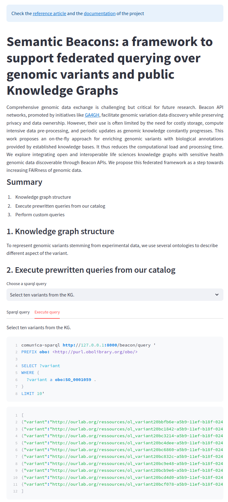

# SemanticBeacon
A framework to allow federated SPARQL queries with genomic variants and public knowlegde graphs

In this repo, we show code supporting our paper submitted at SWAT4HCLS 2025: 
 - An RML mapping
 - Beacon sample response
 - The transformed response in RDF, following FALDO, GENO, and SO ontologies
 - A federated SPARQL query showcasing how to combine UniprotKB, Wikidata and genomic Beacon content

# Implementation
We implemented the SemanticBeacon architecture on an IFB (Institut Français de Bioinformatique) virtual machine.

Please visit: https://134.158.249.80/

You can try several pre-written sparql queries leveraging the beacon-odmtp knowledge graph containing a small
test genomic variation dataset.

